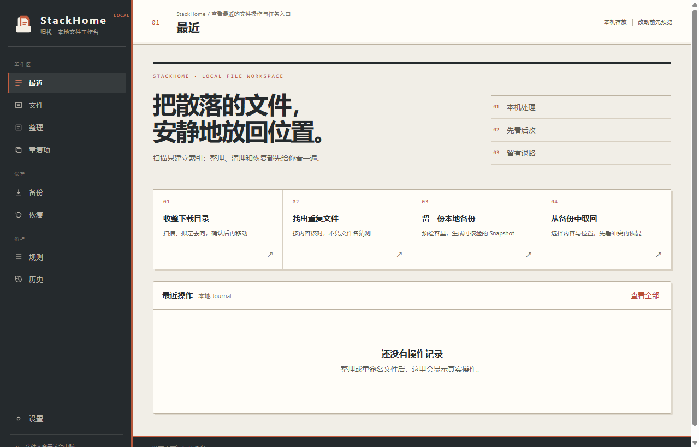

# StackHome（归栈）

[English](README.en.md)

StackHome 是一款面向 Windows 的本地文件工作台，用于文件索引、整理、重复项检查、备份与恢复。它不需要账号，不上传文件；任何批量文件变更都先生成计划，再由用户确认执行。



## 主要功能

| 功能 | 说明 |
| --- | --- |
| 文件目录 | 扫描文件夹并建立 SQLite 索引，按名称、路径和类型查询 |
| 文件整理 | 使用 AND / OR / NOT 规则生成移动、复制、重命名、标签或忽略计划 |
| 重复项检查 | 通过文件大小、预哈希和 BLAKE3 完整哈希确认完全重复文件 |
| 相似图片 | 使用感知哈希和汉明距离查找视觉相近的图片 |
| 元数据 | 读取扩展名与文件类型差异、图片尺寸、EXIF/GPS、音频标签及 MP4 信息 |
| 本地备份 | 支持自定义来源、排除规则、空间预检、增量 Snapshot、Manifest、ZIP/7Z 和完整校验 |
| 恢复与撤销 | 恢复前检查冲突；移动和重命名操作写入 Journal，可在安全条件下撤销 |
| 自动化 | 支持 Watch Folder、明确授权的规则自动应用、定时备份和 Windows 托盘 |

## 安全边界

- 扫描、索引和计划生成不会修改文件。
- 批量操作必须先预览；执行前重新检查源文件大小和修改时间。
- 跨盘移动按 Copy → Verify → Journal → Delete Source 执行，校验失败时保留源文件。
- 目标冲突和撤销冲突不会覆盖现有文件。
- 重复文件默认进入 Windows 回收站，不默认永久删除。
- 数据只保存在本机，不提供账号、云同步或遥测上传。

## 下载

前往 [GitHub Releases](https://github.com/rowanjove/stackhome/releases/latest) 下载：

- `StackHome-Portable-Windows-x64-v0.6.2.exe`：便携版，直接运行。
- `StackHome-Setup-Windows-x64-v0.6.2.exe`：安装版，适合长期使用。
- `SHA256SUMS.txt`：用于核对下载文件。

支持 Windows 10/11 x64。当前发布包未做商业代码签名，Windows SmartScreen 可能显示未知发布者提示。

## 项目信息

| 项目 | 内容 |
| --- | --- |
| 当前版本 | v0.6.2 |
| 桌面框架 | Tauri 2 |
| 前端 | React 19、TypeScript、Vite |
| 后端 | Rust |
| 本地存储 | SQLite WAL；只保存索引、任务、规则、计划和历史，不保存文件内容 |
| 支持平台 | Windows 10/11 x64 |
| 开源协议 | MIT |

为兼容旧版本，应用标识和既有本地数据目录保持不变。公开产品名、窗口标题和发布文件统一使用 StackHome。

## 从源码运行

需要 Node.js、Rust 和 Tauri 2 的 Windows 构建依赖。

```bash
npm install
npm run tauri dev
```

验证和构建：

```bash
npm test
npm run build
cargo test --manifest-path src-tauri/Cargo.toml
cargo check --manifest-path src-tauri/Cargo.toml
npm run build:windows:portable
npm run build:windows:installer
```

## 当前边界

StackHome 尚未提供 PDF/DOCX 正文抽取、OCR、云同步、账号系统或跨平台版本。浏览器中的 Vite 预览只能检查界面，文件操作和系统集成需要在 Tauri 桌面程序中运行。

## License

[MIT](LICENSE)
